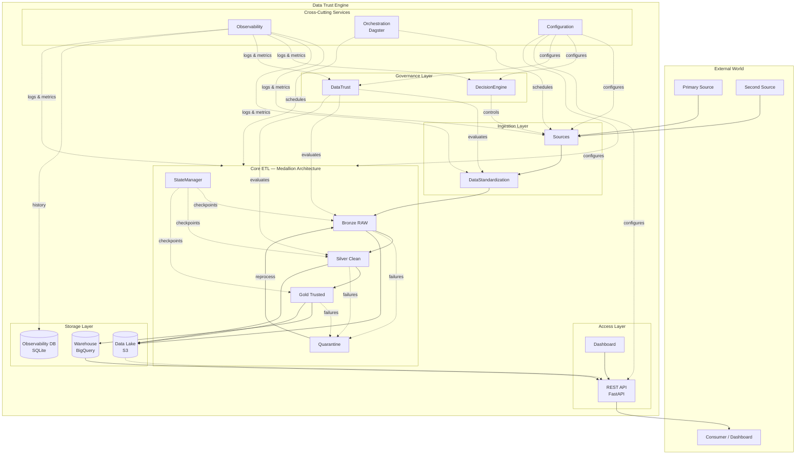
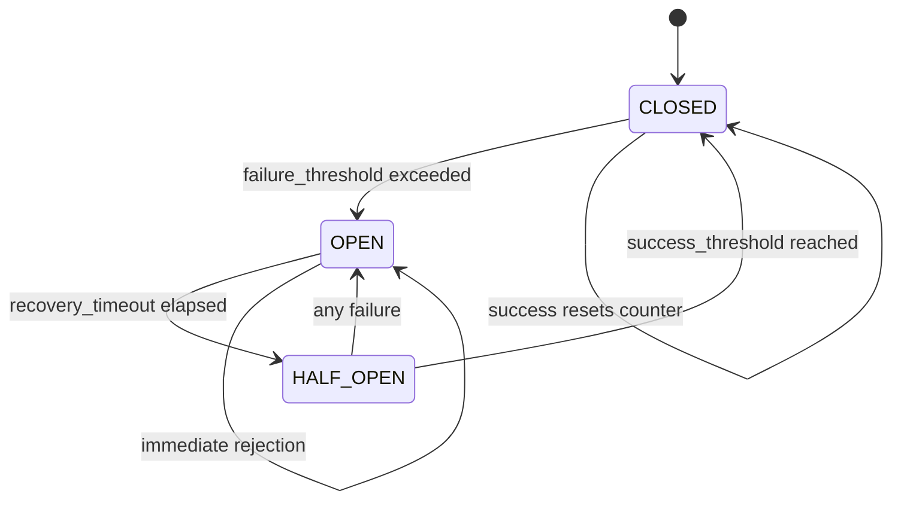
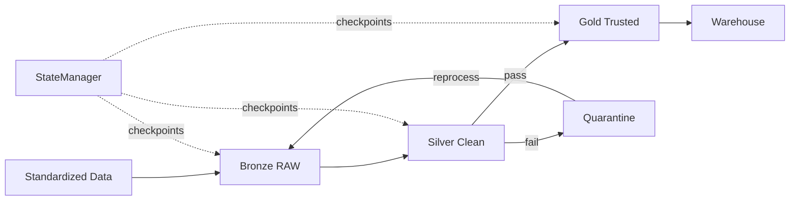
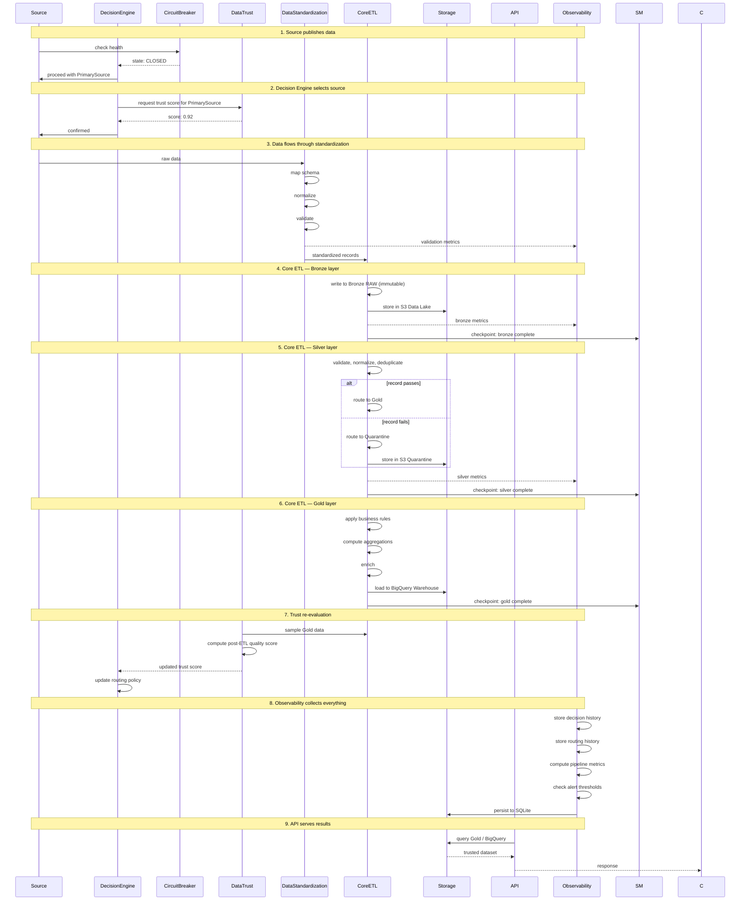
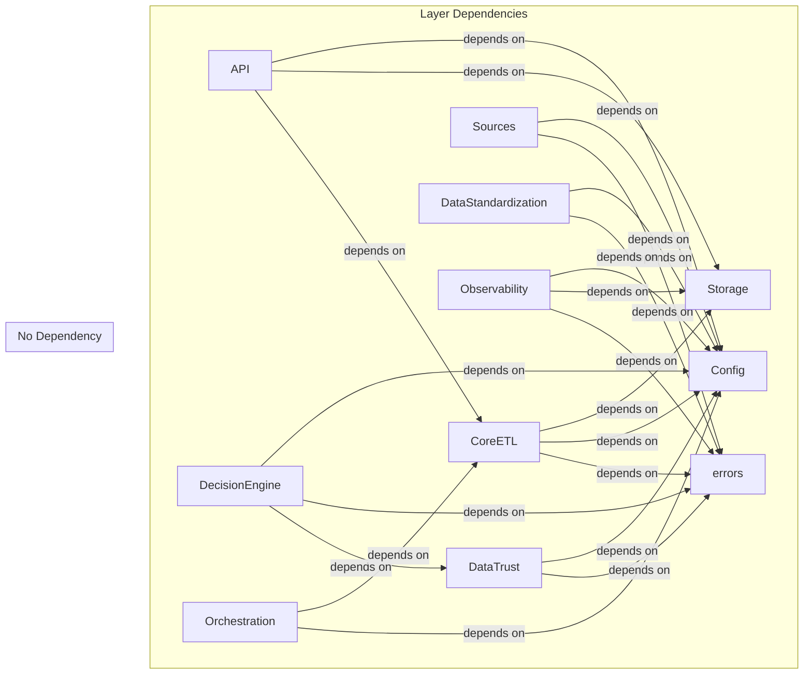

# Data Trust Engine — Architecture Overview

**Version:** 0.2.0 — **Status:** Architecture & Bootstrap  
**Last Updated:** 2026-07-09

---

## Table of Contents

1. [Architecture Overview](#architecture-overview)
2. [High-Level Diagram](#high-level-diagram)
3. [Layer Responsibilities](#layer-responsibilities)
   - [Sources](#sources)
   - [DataStandardization](#datastandardization)
   - [DataTrust](#datatrust)
   - [DecisionEngine](#decisionengine)
   - [CoreETL](#coreetl)
   - [Storage](#storage)
   - [Observability](#observability)
   - [Orchestration](#orchestration)
   - [Configuration](#configuration)
   - [API](#api)
   - [Dashboard](#dashboard)
4. [Complete Data Flow](#complete-data-flow)
5. [Dependency Graph](#dependency-graph)
6. [Design Principles](#design-principles)
7. [Architecture Decision Records](#architecture-decision-records)

---

## Architecture Overview

The **Data Trust Engine** is a production-grade data engineering platform designed to build reliable ETL pipelines with automatic source failover, trust-based decision making, and comprehensive observability. It ingests data from multiple independent sources, evaluates their trustworthiness in real time, transforms data through a Medallion Architecture (Bronze → Silver → Gold), and exposes trusted data through a unified REST API.

The platform solves three fundamental problems in modern data engineering:

1. **Source Reliability** — External data sources fail, degrade, or produce conflicting data. The platform detects failures via Circuit Breaker patterns, automatically fails over between sources, and quantifies data trustworthiness before it reaches consumers.
2. **Data Quality at Scale** — Raw data is never trusted. Every record passes through validation, normalization, deduplication, and business rule enforcement. Failed records are quarantined for reprocessing, never silently dropped.
3. **Observability as a First-Class Citizen** — Every decision, transformation, and data movement is logged, metered, and stored. The platform can explain *why* a particular source was chosen, *how* trust was computed, and *what* happened to every record.

---

## High-Level Diagram



---

## Layer Responsibilities

### Sources

**What it does.**  
The Sources layer encapsulates all external data source connectors. Each source (Primary, Secondary, etc.) has its own client, parser, cursor manager, and schema definition. Shared infrastructure — HTTP client configuration, retry logic with exponential backoff — lives in `Sources/Common/Retry/`.

**Why it exists.**  
Sources are the external boundary of the platform. Without a dedicated layer, connector logic would leak into ETL code, making the system brittle and impossible to test in isolation. Every source has different authentication, pagination, rate limiting, and failure modes. Encapsulating each source behind a consistent interface allows the platform to treat all sources uniformly.

**What problems it solves.**

| Problem | Solution |
|---|---|
| Diverse authentication mechanisms | Each source encapsulates its own auth flow |
| Unreliable external APIs | Retry/backoff in `Sources/Common/Retry/` |
| Pagination differences | `cursor.py` per source normalizes pagination |
| Schema drift | `schema.py` per source defines expected shape |

**Dependencies.**  
- `Config` for connection parameters (endpoints, credentials)
- `Observability` for logging and metrics  
- `errors.SourceError` hierarchy for failure reporting

**Data flow.**  
Sources produce raw, unvalidated data. The output is passed to `DataStandardization` for schema mapping and normalization. The `DecisionEngine` controls *which* source to call and *when* to fail over between them.

---

### DataStandardization

**What it does.**  
DataStandardization normalizes raw data from different sources into a single canonical schema. It performs:

- **Schema Mapping (`mapper.py`)** — Translates source-specific field names and types into the canonical schema.
- **Normalization (`normalizer.py`)** — Converts units, formats, timezones, and encodings to a standard representation.
- **Validation (`validator.py`)** — Ensures data conforms to the canonical schema constraints before entering the ETL pipeline.

**Why it exists.**  
Raw data from different sources arrives in different shapes. A date might be `"2024-01-15"` from one source, `"01/15/2024"` from another, and `{year: 2024, month: 1, day: 15}` from a third. Without standardization, the Core ETL would need to handle every source's idiosyncrasies — violating the Open/Closed Principle and making the pipeline brittle.

**Data flow.**  
Standardized records → `CoreETL/BronzeRAW/ingest.py`.  
Failed records → `CoreETL/Quarantine/`.

---

### DataTrust

**What it does.**  
DataTrust is the platform's brain for evaluating data quality and source trustworthiness. It operates on data *after* standardization but independently of the Core ETL pipeline (per ADR-004). It consists of four sub-modules:

#### Reconciliation (`DataTrust/Reconciliation/`)

Cross-source comparison that identifies matching and conflicting records between Primary and Secondary sources.

| Component | Responsibility |
|---|---|
| `compare.py` | Pairwise record comparison across sources |
| `confidence.py` | Source-level confidence scoring |
| `consensus.py` | Conflict resolution when sources disagree |
| `trust_core.py` | Aggregated trust metric computation |

#### DataQuality (`DataTrust/DataQuality/`)

Statistical and rule-based quality assessment of individual records and streams.

| Component | Responsibility |
|---|---|
| `statistics.py` | Distribution analysis, null-rate tracking, schema conformance |
| `anomaly.py` | Outlier detection, sudden volume changes, drift detection |
| `audit.py` | Full data provenance tracking per record |

#### LLMExplainability (`DataTrust/LLMExplainability/`)

An innovative layer that uses Large Language Models to generate human-readable explanations of trust scores. For example: *"Source A was downgraded from 0.95 to 0.72 because 3 of 5 currency fields failed ISO 4217 validation, and the daily volume dropped 40% compared to the 7-day moving average."*

| Component | Responsibility |
|---|---|
| `llm_analyzer.py` | Orchestrates LLM calls with trust context |
| `prompts.py` | Carefully engineered prompt templates |

**Why a separate trust layer (ADR-004).**  
Trust evaluation is a fundamentally different concern from data transformation. The Core ETL transforms data; the Trust Layer evaluates it. Merging them would create a monolith where quality checks block pipeline progress and pipeline changes accidentally affect scoring. Separation allows:

- Independent scaling (trust can be computed async)
- Independent deployment (trust model updates don't require ETL redeployment)
- Independent testing (trust evaluation has different performance characteristics)
- Clear ownership (data science owns trust; data engineering owns ETL)

**Dependencies.**  
- `DataStandardization` for canonical schema (trust evaluates standardized data)
- `Observability` for audit trail and metric emission
- `Config` for thresholds (`DataTrust/config/thresholds.yml`, `confidence.yml`)

**Data flow.**  
Trust scores → `DecisionEngine` (for routing decisions) + `Observability` (for dashboards and alerts).

---

### DecisionEngine

**What it does.**  
The Decision Engine makes real-time operational decisions about data sources. It never analyzes data content — it analyzes *source behavior*: availability, latency, error rates, and trust scores.

**Critical design constraint: The Decision Engine never reads data. It reads metadata and makes decisions.**

#### CircuitBreaker (`DecisionEngine/CircuitBreaker/`)

A full state machine with three states:



| Parameter | Default | Meaning |
|---|---|---|
| `failure_threshold` | 5 | Consecutive failures before circuit opens |
| `success_threshold` | 2 | Consecutive successes in HALF_OPEN to close |
| `recovery_timeout` | 30s | Time before circuit transitions OPEN → HALF_OPEN |

#### Routing (`DecisionEngine/Routing/`)

| Component | Responsibility |
|---|---|
| `failover.py` | Automatic source switching when circuit trips |
| `switch_rules.py` | Configurable policies for source selection (latency-priority, trust-priority, cost-priority) |

#### Alerts (`DecisionEngine/Alerts/`)

Fires notifications when sources change state or when routing decisions are made. Integrates with `Observability/Notifications/`.

**Why a separate Decision Engine.**  
Routing decisions require different expertise than data transformation. They depend on real-time source health metrics, trust scores, and operational policies — not on the content of the data itself. Separating decision logic makes it testable, auditable, and independently deployable.

**Dependencies.**  
- `DataTrust` for trust scores (input to routing decisions)
- `Observability` for metric emission and alert routing
- `Config` for thresholds (`DecisionEngine/config/circuit_breaker.yml`, `routing.yml`, `switch_rules.yml`)

**Data flow.**  
Decisions (which source to use, whether to fail over) → `Sources` (controls connector selection) + `Observability/DecisionHistory/` + `Observability/RoutingHistory/`.

---

### CoreETL

The heart of the platform. Implements the **Medallion Architecture** with four data zones and a state management layer.

#### Bronze RAW (`CoreETL/BronzeRAW/`)

Immutable raw data storage (per ADR-002). Every record from every source is preserved exactly as received.

| Component | Responsibility |
|---|---|
| `ingest.py` | Accepts standardized records and writes to Bronze storage |
| `incremental.py` | Supports incremental (delta-only) ingestion with watermarks |
| `watermark.py` | Tracks the last successfully ingested position per source |
| `recovery.py` | Recovers from interruptions using checkpoint data |
| `state.py` | In-memory and persisted state for the Bronze layer |

**Key property: Immutability.**  
Bronze data is never modified. If a record needs to be re-processed, the pipeline replays from the Bronze checkpoint. This guarantees full reproducibility.

#### Silver Clean (`CoreETL/Silver/`)

Validated, normalized, and deduplicated data. Records that fail Silver processing are routed to Quarantine.

| Component | Responsibility |
|---|---|
| `validation.py` | Schema and business rule validation |
| `normalization.py` | Type coercion, format standardization |
| `deduplication.py` | Exact and fuzzy deduplication across sources |
| `routing.py` | Directs valid records to Gold, failed records to Quarantine |
| `metrics.py` | Silver-layer quality metrics (pass/fail rates, dedup ratios) |

#### Gold Trusted (`CoreETL/GoldTrusted/`)

Business-ready data. Aggregations are computed, business rules are applied, and data is enriched for consumption.

| Component | Responsibility |
|---|---|
| `aggregations.py` | Business-level aggregations (daily totals, rolling windows, etc.) |
| `business_rules.py` | Domain-specific rule engine |
| `enrichment.py` | Cross-reference and lookup enrichment |
| `export.py` | Data export to Warehouse and Data Lake |

#### Quarantine (`CoreETL/Quarantine/`)

Failed records are never deleted (per ADR-003). They are preserved in Quarantine for analysis and reprocessing.

| Component | Responsibility |
|---|---|
| `quarantine.py` | Quarantine lifecycle management |
| `storage.py` | Quarantine record persistence |
| `reprocess.py` | Re-queues quarantined records for re-processing |
| `reports.py` | Quarantine analytics and reporting |

#### StateManager (`CoreETL/StateManager/`)

Persistence layer for pipeline state. Enables resumability — if a pipeline run is interrupted, the StateManager ensures the next run picks up from the last checkpoint.

| Component | Responsibility |
|---|---|
| `checkpoint.py` | Checkpoint creation, validation, and recovery |
| `state_store.py` | State persistence backend abstraction |

#### Warehouse (`CoreETL/Warehouse/`)

Bridge between Core ETL and the Warehouse storage backend. Uses `AbstractWarehouse` from `Storage/interfaces.py` so the ETL never depends on a specific warehouse implementation (ADR-005).

**Data flow within CoreETL:**



---

### Storage

Three distinct storage backends with different purposes, isolated behind abstract interfaces (ADR-005).

#### Data Lake — Amazon S3 (`Storage/DataLake/AmazonS3/`)

Object storage for raw (Bronze) and intermediate (Silver, Gold) data. Serves as the system of record.

| Component | Responsibility |
|---|---|
| `client.py` | S3 API client |
| `reader.py` | S3 read operations |
| `writer.py` | S3 write operations |
| `lifecycle.py` | S3 lifecycle policy management (expiration, transitions to Glacier) |

**Implements:** `AbstractDataLake`

#### Warehouse — Google BigQuery (`Storage/Warehouse/GoogleBigQuery/`)

Analytics warehouse for Gold (trusted) data. Optimized for SQL-based querying and BI tool integration.

| Component | Responsibility |
|---|---|
| `client.py` | BigQuery API client |
| `loader.py` | Bulk load operations |
| `writer.py` | Streaming insert operations |
| `models.py` | BigQuery table schemas and DDL |

**Implements:** `AbstractWarehouse`

#### Observability DB — SQLite (`Storage/ObservabilityDB/SQLite/`)

Lightweight embedded database for operational observability data: decision history, routing history, pipeline metrics, and alert records. SQLite is chosen for zero operational overhead — no database server to manage.

| Component | Responsibility |
|---|---|
| `client.py` | SQLite connection management |
| `repository.py` | Repository pattern for data access |
| `writer.py` | Write operations |
| `migration.py` | Schema migrations |

**Implements:** `AbstractObservabilityDB`

**Why three backends.**  
Each backend solves a different problem:

| Backend | Use Case | Why |
|---|---|---|
| S3 Data Lake | Immutable raw storage, large files | Cheap, durable, scalable |
| BigQuery Warehouse | Analytics, SQL querying | Columnar, fast, serverless |
| SQLite Observability DB | Operational history, small records | Zero-dependency, embedded, transactional |

---

### Observability

**What it does.**  
Observability is a cross-cutting concern that collects, stores, and surfaces operational data from every layer of the platform. It is not a sidecar — it is an integral part of the architecture, represented by dashed arrows in the high-level diagram that connect to every other module.

**Why a separate layer.**  
Observability requirements (metric cardinality, storage retention, query patterns) differ fundamentally from data pipeline requirements. Mixing observability code into ETL logic creates coupling, makes pipelines harder to test, and prevents independent scaling of the observability infrastructure.

#### Sub-Modules

| Module | Responsibility |
|---|---|
| `Logs/logger.py` | Structured logging with `structlog`, emitted by every module |
| `Metrics/source_metrics.py` | Per-source health, latency, throughput |
| `Metrics/metrics_pipeline.py` | ETL pipeline metrics (records ingested, passed, quarantined) |
| `Metrics/trust_metrics.py` | Trust score distribution, drift |
| `DecisionHistory/decision_history.py` | Complete immutable log of every Decision Engine decision |
| `RoutingHistory/switch_history.py` | History of source switches and failover events |
| `Reports/reports.py` | Scheduled and on-demand report generation |
| `Notifications/notifications.py` | Alert dispatch (email, Slack, PagerDuty) |
| `Explainability/explainability.py` | Human-readable descriptions of pipeline behavior |
| `Databand/airflow_monitoring.py` | (Legacy) Airflow DAG monitoring |
| `Databand/dag_health.py` | Dagster job/asset health |
| `Databand/pipeline_status.py` | Real-time pipeline status |

---

### Orchestration

**Role of Dagster.**  
Dagster is the orchestration framework (ADR-007). It schedules, monitors, and manages the execution of Core ETL pipeline runs. It is the *when* and the *in what order* — never the *how*.

**Why Dagster knows nothing about data processing logic.**  
The `Orchestration/dagster/` directory contains only four files:

| File | Purpose |
|---|---|
| `assets.py` | Software-defined assets that declare dependencies between data assets |
| `jobs.py` | Materialization jobs that bind assets to execution config |
| `schedules.py` | Time-based or event-based triggers for jobs |
| `definitions.py` | Combines assets, jobs, schedules into a Dagster code location |

Dagster calls into `CoreETL` via well-defined interfaces. It does not import ETL logic, does not know about BigQuery schemas, and does not contain transformation code. This separation means:

- **ETL logic is testable without Dagster** — unit tests run in milliseconds
- **Dagster can be replaced** — the orchestration framework is an implementation detail
- **Parallel execution is safe** — Dagster's asset graph prevents dependency violations

**Workspace configuration (`workspace.yaml`):**

```yaml
load_from:
  - python_module:
      module_name: Orchestration.dagster.definitions
      working_directory: /app
```

---

### Configuration

**Centralized Config (`Config/`).**  
The `Config/` module is the single source of truth for environment-specific settings. Built on Pydantic v2 `BaseSettings`, it loads from `.env` files and environment variables, validates all values at startup, and provides a typed, immutable settings object to every module.

```
Config/
├── defaults.py      # Default values for all settings
├── logging.py       # LogSettings
├── storage.py       # S3Settings, BigQuerySettings, SQLiteSettings
├── settings.py      # AppSettings — composes all sub-settings
└── __init__.py      # Public API: from Config import settings
```

**Local module configs (`config/` directories).**  
Some modules have their own `config/` directories with YAML files:

```
DecisionEngine/config/circuit_breaker.yml
DecisionEngine/config/routing.yml
DecisionEngine/config/switch_rules.yml
DataTrust/config/reconciliation.yml
DataTrust/config/confidence.yml
DataTrust/config/thresholds.yml
Observability/config/alerts.yml
Observability/config/metrics.yml
```

These YAML files contain **operational policies** — things that change more frequently than environment variables and that different teams may own:

| Config Type | Example | Owner | Change Frequency |
|---|---|---|---|
| Env vars (`.env` / `Config/`) | `BIGQUERY_DATASET`, `S3_BUCKET` | Platform Engineering | Rare (infrastructure) |
| YAML policies | `failure_threshold: 5`, `confidence_min: 0.8` | Data Science / Ops | Frequent (tuning) |

**Why two config mechanisms.**  
Environment variables are ideal for secrets and infrastructure parameters (they integrate with Kubernetes, Docker, CI/CD). YAML files are ideal for operational policies (they can be version-controlled, reviewed via PR, and reloaded without restarting the process).

---

### API

**What it does.**  
The REST API is the only external entry point to the platform (ADR-006). It provides controlled, authenticated access to trusted data, pipeline status, and administrative operations.

**Stack:** FastAPI with Uvicorn, Pydantic v2 schemas, CORS enabled.

**Routes.**

| Prefix | Endpoints | Status | Purpose |
|---|---|---|---|
| `GET /api/v1/health` | Health check | ✅ | Readiness probe for container orchestration |
| `GET /api/v1/sources` | List all sources | ✅ | Source overview |
| `GET /api/v1/sources/{id}` | Source detail | ✅ | Per-source health + state |
| `POST /api/v1/etl/run` | Trigger ETL | 🔧 | Manual pipeline execution |
| `GET /api/v1/etl/runs/{id}` | ETL run status | 🔧 | Pipeline progress |
| `GET /api/v1/trust/score/{id}` | Trust score | 🔧 | Source trust evaluation |
| `GET /api/v1/trust/reconciliation/{a}/{b}` | Cross-source reconciliation | 🔧 | Source comparison |
| `GET /api/v1/decisions/circuit-breaker/{id}` | Circuit breaker state | 🔧 | Source health state |
| `POST /api/v1/decisions/circuit-breaker/{id}` | Circuit breaker actions | 🔧 | Reset / trip |
| `POST /api/v1/data/query` | Query data | 🔧 | Data retrieval from layers |

✅ = Implemented · 🔧 = Placeholder (501 Not Implemented)

**Architecture.**  

```
API/
├── main.py              # FastAPI app creation, CORS, lifespan, router inclusion
├── dependencies.py      # Dependency injection (get_settings, etc.)
├── schemas.py           # All Pydantic request/response models
└── routes/
    ├── __init__.py      # APIRouter aggregation
    ├── health.py        # Health endpoints
    ├── sources.py       # Source management endpoints
    ├── etl.py           # ETL lifecycle endpoints
    ├── trust.py         # Trust score endpoints
    ├── decisions.py     # Decision / circuit breaker endpoints
    └── data.py          # Data query endpoints
```

---

### Dashboard

**Status:** Placeholder (`Dashboard/__init__.py` only).

The future dashboard will consume the REST API to provide a web-based UI for:

- Real-time pipeline status
- Source health and circuit breaker state
- Trust score visualizations
- Reconciliation reports
- Decision history timeline
- Quarantine management

---

## Complete Data Flow

### Step-by-step walkthrough of a full pipeline run:



---

## Dependency Graph



**Key observations:**

1. **`errors.py` and `Config/` are leaf nodes** — they depend on nothing within the project. Every other module depends on them.
2. **`Storage/` is a leaf node** — per ADR-005, storage interfaces are independent of business logic. No business module depends on a concrete storage implementation.
3. **`DataTrust` does not depend on `CoreETL`** — trust evaluation is independent of data transformation (ADR-004).
4. **`DecisionEngine` depends on `DataTrust` but not on `CoreETL`** — decisions are based on trust, not on data content.
5. **`CoreETL` depends on `Storage` interfaces, not implementations** — BigQuery, S3, and SQLite are swappable.

---

## Design Principles

### Separation of Concerns

Every module has exactly one responsibility. The Decision Engine makes decisions; it does not transform data. The Trust Layer evaluates trust; it does not route traffic. The Core ETL transforms data; it does not evaluate trust. This separation makes each module independently testable, deployable, and understandable.

### Dependency Inversion

High-level modules (CoreETL) depend on abstractions (`AbstractWarehouse`), not on concrete implementations (`BigQueryWarehouse`). Concrete implementations depend on the same abstractions. This is enforced at the package level: `CoreETL/` imports from `Storage/interfaces.py`, not from `Storage/Warehouse/GoogleBigQuery/`.

### Open/Closed Principle

Modules are open for extension but closed for modification. Adding a new data source requires creating a new directory in `Sources/` implementing the same interface pattern — not modifying existing code. Adding a new storage backend requires implementing `AbstractWarehouse` — not changing CoreETL.

### Layer Isolation

Each layer communicates only with its immediate neighbors. Sources do not write directly to BigQuery. The API does not call sources directly. This creates a clean dependency chain that can be understood, tested, and secured at each boundary.

### Fail Fast

The Circuit Breaker pattern ensures that failing sources are detected quickly and traffic is redirected before downstream systems are affected. Validation in `DataStandardization` catches malformed data before it enters the ETL pipeline. Configuration validation in `Config/` catches misconfiguration at startup.

### Observability First

Observability is not an afterthought — every module emits structured logs, metrics, and events. The `Observability/` layer is included in the architecture from day one, with dedicated storage (SQLite), decision history, and alerting infrastructure.

### Trust First

Data is never trusted by default. Every record passes through validation, trust scoring, and reconciliation before reaching consumers. The Trust Layer is a first-class architectural component with the same status as the ETL pipeline.

### Enterprise Ready

- **Immutable data lineage** (ADR-002) — every record can be traced from API response to Bronze storage
- **Quarantine instead of deletion** (ADR-003) — nothing is lost
- **Single API entry point** (ADR-006) — security, rate limiting, and access control implemented once
- **Configuration validation at startup** — Pydantic catches typos and missing values before production impact
- **Structured logging** — `structlog` ensures machine-parseable logs with consistent field names

---

## Architecture Decision Records

All significant architectural decisions are documented in `Docs/decisions.md`:

| ADR | Decision | Key Principle |
|---|---|---|
| ADR-001 | Each source has its own Dagster asset/job | Independence |
| ADR-002 | Raw data is immutable | Reproducibility |
| ADR-003 | Failed records go to Quarantine | Data lineage |
| ADR-004 | Decision Engine and Trust Layer are separate | Separation of concerns |
| ADR-005 | Storage is isolated from business logic | Dependency inversion |
| ADR-006 | API is the only external entry point | Security |

---

*This document is maintained as part of the Data Trust Engine project. For questions, contact the platform architecture team.*
